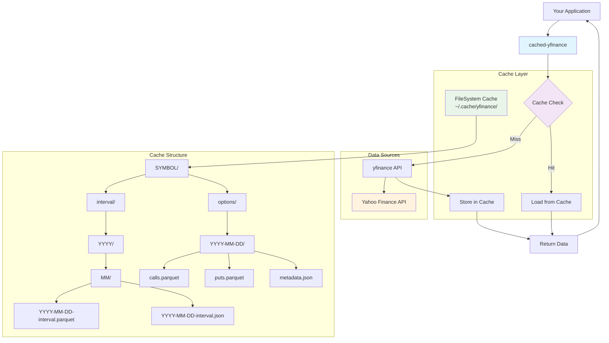

# Cached YFinance Architecture

This document provides detailed technical information about the cached-yfinance library architecture, API reference, and cache structure.

## 🏗️ System Architecture

The cached-yfinance library acts as a caching layer between your application and the yfinance library, providing significant performance improvements through intelligent data storage and retrieval.



## 🛠️ API Reference

### Module-level Functions

#### `download(tickers, start=None, end=None, period=None, interval="1d", **kwargs)`

Drop-in replacement for `yfinance.download()` with caching.

**Parameters:**

- `tickers` (str or list): Ticker symbol(s) to download
- `start` (str, datetime, optional): Start date for data
- `end` (str, datetime, optional): End date for data
- `period` (str, optional): Period to download (e.g., "1y", "6mo", "1d")
- `interval` (str): Data interval (1m, 5m, 15m, 30m, 1h, 1d, 5d, 1wk, 1mo, 3mo)
- `**kwargs`: Additional arguments passed to yfinance

**Returns:**

- `pandas.DataFrame`: Historical market data

#### `get_options_expirations(ticker, use_cache=True)`

Get available option expiration dates for a ticker.

**Parameters:**

- `ticker` (str): Stock symbol
- `use_cache` (bool): Whether to use cached data if available

**Returns:**

- `tuple`: Tuple of expiration date strings (YYYY-MM-DD format)

#### `get_option_chain(ticker, expiration=None, use_cache=True)`

Get option chain data for a ticker and expiration date.

**Parameters:**

- `ticker` (str): Stock symbol
- `expiration` (str, optional): Expiration date in YYYY-MM-DD format. If None, uses nearest expiration.
- `use_cache` (bool): Whether to use cached data if available

**Returns:**

- `OptionChain`: NamedTuple with `calls`, `puts` DataFrames and `underlying` data dict

### Classes

#### `CachedYFClient`

Main client class for cached yfinance operations.

```python
from cached_yfinance import CachedYFClient, FileSystemCache

# Initialize with default cache
client = CachedYFClient()

# Initialize with custom cache
cache = FileSystemCache("/path/to/cache")
client = CachedYFClient(cache)

# Download data
data = client.download("AAPL", period="1y")
```

#### `FileSystemCache`

File system-based cache implementation.

```python
from cached_yfinance import FileSystemCache

# Default cache location (~/.cache/yfinance)
cache = FileSystemCache()

# Custom cache location
cache = FileSystemCache("/custom/path")

# Check if data is cached
from cached_yfinance import CacheKey
from datetime import date

key = CacheKey(symbol="AAPL", interval="1d", day=date.today())
if cache.has(key):
    data = cache.load(key)
```

#### `CacheKey`

Represents a cache key for a specific symbol, interval, and date.

```python
from cached_yfinance import CacheKey
from datetime import date

key = CacheKey(symbol="AAPL", interval="1d", day=date(2023, 12, 25))
```

#### `OptionCacheKey`

Represents a cache key for option chain data.

```python
from cached_yfinance import OptionCacheKey

# Create keys for different option data types
calls_key = OptionCacheKey.for_calls("AAPL", "2024-01-19")
puts_key = OptionCacheKey.for_puts("AAPL", "2024-01-19")
underlying_key = OptionCacheKey.for_underlying("AAPL", "2024-01-19")
```

#### `OptionChain`

NamedTuple containing option chain data.

```python
from cached_yfinance import get_option_chain

option_chain = get_option_chain("AAPL")
calls_df = option_chain.calls      # DataFrame with call options
puts_df = option_chain.puts        # DataFrame with put options
underlying_data = option_chain.underlying  # Dict with stock info
```

## 🗂️ Cache Structure

The cache organizes data in a hierarchical structure optimized for fast lookups and efficient storage:

```
~/.cache/yfinance/
├── AAPL/
│   ├── 1d/
│   │   ├── 2023/
│   │   │   ├── 12/
│   │   │   │   ├── 2023-12-25-1d.parquet
│   │   │   │   └── 2023-12-25-1d.json
│   │   └── 01/
│   ├── 1h/
│   └── options/
│       ├── 2024-01-19/
│       │   ├── calls.parquet
│       │   ├── puts.parquet
│       │   └── metadata.json
│       └── 2024-02-16/
└── TSLA/
    ├── 1d/
    └── options/
```

### Cache Entry Structure

Each cache entry consists of:

**Price Data:**

- **`.parquet` file**: Compressed pandas DataFrame with market data
- **`.json` file**: Metadata including symbol, date, row count, and columns

**Option Data:**

- **`calls.parquet`**: DataFrame with call option contracts
- **`puts.parquet`**: DataFrame with put option contracts
- **`metadata.json`**: Metadata including underlying stock data, contract counts, and cache timestamp

### Cache Key Generation

The cache uses a hierarchical key structure:

```python
# Price data cache key
symbol/interval/YYYY/MM/YYYY-MM-DD-interval.{parquet,json}

# Option data cache key
symbol/options/YYYY-MM-DD/{calls,puts}.parquet
symbol/options/YYYY-MM-DD/metadata.json
```

## 🔄 Data Flow

### Price Data Flow

1. **Request**: Application calls `cyf.download("AAPL", period="1y")`
2. **Cache Check**: System generates cache keys for each required day
3. **Cache Hit**: If data exists and is valid, return cached data
4. **Cache Miss**: If data missing or stale:
   - Fetch from yfinance API
   - Store in cache as parquet + metadata
   - Return data to application
5. **Merge**: Combine cached and fresh data if needed

### Option Data Flow

1. **Request**: Application calls `cyf.get_option_chain("AAPL")`
2. **Expiration Check**: Get available expiration dates (cached if available)
3. **Cache Lookup**: Check for cached option chain data
4. **Data Retrieval**:
   - Cache hit: Load calls.parquet, puts.parquet, metadata.json
   - Cache miss: Fetch from yfinance, store in cache
5. **Return**: Provide OptionChain namedtuple with calls, puts, underlying data

## 🚀 Performance Optimizations

### Storage Optimizations

- **Parquet Format**: Efficient columnar storage with compression
- **Hierarchical Structure**: Fast directory-based lookups
- **Metadata Separation**: Quick validation without loading full data

### Caching Strategy

- **Day-based Caching**: Each trading day cached separately
- **Interval Separation**: Different intervals stored independently
- **Option Expiration Grouping**: Options grouped by expiration date
- **Lazy Loading**: Data loaded only when accessed

### Memory Management

- **Streaming**: Large datasets processed in chunks
- **Garbage Collection**: Automatic cleanup of temporary objects
- **Efficient Merging**: Smart concatenation of cached and fresh data

## 🔧 Configuration

### Environment Variables

- `CACHED_YFINANCE_CACHE_DIR`: Override default cache directory

### Cache Management

```python
from cached_yfinance import FileSystemCache

cache = FileSystemCache()

# List cached days for a symbol
cached_days = list(cache.iter_cached_days("AAPL", "1d"))
print(f"Cached {len(cached_days)} days for AAPL")

# List cached option expirations
cached_expirations = list(cache.iter_cached_option_expirations("AAPL"))
print(f"Cached {len(cached_expirations)} option expirations for AAPL")

# Check cache size
import os
cache_size = sum(
    os.path.getsize(os.path.join(dirpath, filename))
    for dirpath, dirnames, filenames in os.walk(cache.root)
    for filename in filenames
)
print(f"Cache size: {cache_size / 1024 / 1024:.2f} MB")
```

## 🔒 Thread Safety

The cached-yfinance library is designed to be thread-safe:

- **File Locking**: Prevents concurrent writes to the same cache file
- **Atomic Operations**: Cache writes are atomic (temp file + rename)
- **Read Concurrency**: Multiple threads can safely read cached data
- **Directory Creation**: Thread-safe directory structure creation

## 🎯 Future Architecture Considerations

- **Pluggable Cache Backends**: Redis, SQLite, cloud storage
- **Distributed Caching**: Multi-node cache synchronization
- **Real-time Updates**: WebSocket integration for live data
- **Cache Warming**: Proactive data fetching strategies
- **Compression Levels**: Configurable compression vs. speed trade-offs
